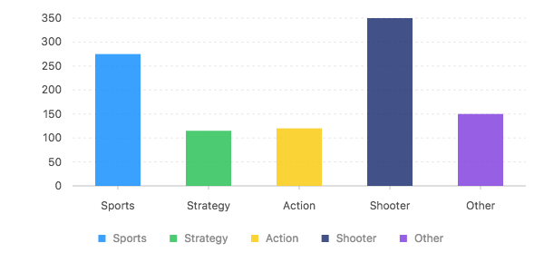

golly
=====

golly is very very much a work in progress. The [G2](https://github/antvis/g2) project implements an incredible JavaScript for building visualizations. G2 is based on the same grammar of graphics as ggplot2 and it shows. The goal of golly is to provide a familiar toolset for R programmers to build interactive web visualizations.

Furthermore, golly would be the visualization backbone of the [dull](https://github.com/nteetor/dull). This is a ways off, but why not keep an eye on the horizon?

example
-------

This minimal example is now up and running. Be aware many similar functions or geoms were skipped over to focus on getting a workable example going. These other functions will come along soon.

``` r
library(golly)

games
```

    #      genre sold
    # 1   Sports  275
    # 2 Strategy  115
    # 3   Action  120
    # 4  Shooter  350
    # 5    Other  150

``` r
games %>%
 chart() %>%
 interval(
   . %>%
     position("genre*sold") %>%
     color("genre")
 )
```



(if run interactively, the chart is also interactive)
